## To Do:
- [ ] Update `CreatingCI_CDPipeline.md` docs to latest process
- [ ] Add monitoring stack (Prometheus, Grafana)
- [ ] Set up email alerting for deployments and application health 

___

# Pi Cluster Config

This repository contains the configuration files for a k3s cluster running on Raspberry Pis.

## CI/CD Pipeline Diagrams

**Note**: GitOps repo refers to this repository.

### Overview

```mermaid
graph LR
    %% Developer workflow
    Dev[👨‍💻 Developer] --> |push code| GHA[🔄 GitHub Actions<br/>Build & Push]
    GHA --> |build & push| Docker[🐳 Docker Registry]
    
    %% Flux components
    subgraph K3s[🏗️ Pi Cluster]
        Flux[🤖 Flux Image Automation<br/>]
    end
    
    Flux --> |scans for new images| Docker
    Flux --> |create PR with new img tag| GitOps[📋 GitOps Repo<br/>Helm Release Charts]
    GitOps --> |watches repo| Flux
    Flux --> |deploys via Helm| Apps[🚀 Applications]
    
    %% Styling
    classDef dev fill:#e1f5fe
    classDef ci fill:#f3e5f5
    classDef store fill:#e8f5e8
    classDef flux fill:#e3f2fd
    classDef app fill:#f1f8e9
    
    class Dev dev
    class GHA ci
    class Docker,GitOps store
    class Flux flux
    class Apps app
```

___
### Detailed Flow

```mermaid
graph TB

    %% GitOps Repository
    GitOps["📋 GitOps Repository<br/>HelmRelease manifest upd8"]
    
    %% Flux Detection
    subgraph FluxControllers["🔄 Flux Controllers"]
        SourceController["📡 Source Controller<br/>Detects Git changes"]
        HelmController["⚙️ Helm Controller<br/>Processes HelmRelease"]
        ImageController["🖼️ Image Controller<br/>Detects new images"]
    end
    
    %% Trigger Events
    GitOps --> |git pull every 1m| SourceController
    Registry["🐳 Container Registry"] --> |scan every 5m| ImageController
    ImageController --> |updates values| GitOps
    
    %% Helm Release Processing
    SourceController --> |change detected| HelmController
    HelmController --> |reads| HelmRelease["📄 HelmRelease Resource<br/>my-app v1.2.3"]
    
    %% Helm Operations
    subgraph HelmOps["🎯 Helm Operations"]
        HelmChart["📊 Fetch Helm Chart<br/>from repository"]
        RenderTemplates["🔧 Render Templates<br/>with values"]
        ApplyManifests["📝 Apply Manifests<br/>to Kubernetes"]
    end
    
    HelmRelease --> HelmChart
    HelmChart --> RenderTemplates
    RenderTemplates --> ApplyManifests
    
    %% Kubernetes Resources Created/Updated
    subgraph K8sResources["🏗️ Kubernetes Resources"]
        direction TB
        Deployment["🚀 Deployment<br/>my-app<br/>replicas: 3<br/>image: nginx:1.2.3"]
        Service["🌐 Service<br/>my-app-service<br/>type: LoadBalancer"]
        ConfigMapRes["📝 ConfigMap<br/>my-app-config"]
        SecretRes["🔐 Secret<br/>my-app-secrets"]
        Ingress["🌍 Ingress<br/>my-app-ingress"]
    end
    
    ApplyManifests --> Deployment
    ApplyManifests --> Service
    ApplyManifests --> ConfigMapRes
    ApplyManifests --> SecretRes
    ApplyManifests --> Ingress
    
    %% Pod Updates
    subgraph Pods["🐳 Pod Updates"]
        OldPods["❌ Old Pods<br/>nginx:1.1.0<br/>Terminating"]
        NewPods["✅ New Pods<br/>nginx:1.2.3<br/>Running"]
    end
    
    Deployment --> |rolling update| OldPods
    Deployment --> |creates| NewPods
    
    %% Status Updates
    subgraph StatusFlow["📊 Status Updates"]
        HelmStatus["📈 Helm Release Status<br/>deployed"]
        FluxStatus["📋 HelmRelease Status<br/>Ready: True<br/>Revision: v1.2.3"]
    end
    
    ApplyManifests --> HelmStatus
    HelmStatus --> FluxStatus
    FluxStatus --> HelmController
    
    %% Styling
    classDef source fill:#e3f2fd
    classDef controller fill:#f3e5f5
    classDef helm fill:#fce4ec
    classDef k8s fill:#e8f5e8
    classDef pods fill:#fff3e0
    classDef status fill:#f1f8e9
    
    class GitOps,Registry source
    class SourceController,HelmController,ImageController controller
    class HelmRelease,HelmChart,RenderTemplates,ApplyManifests helm
    class Deployment,Service,ConfigMapRes,SecretRes,Ingress k8s
    class OldPods,NewPods pods
    class HelmStatus,FluxStatus status
```

## Certificates
For TLS certificates, I use Let's Encrypt with cert-manager to automate issuance and renewal for the cluster's services. To use with a new application, just add an Ingress resource with the following annotations.
```yaml
traefik.ingress.kubernetes.io/router.tls: "true"
cert-manager.io/cluster-issuer: "letsencrypt-prod"
```
## Cloudflare Tunnel
To expose services securely over the internet, I use Cloudflare Tunnel. This allows me to avoid opening ports on my home network while still providing access to my applications.
The setup involves creating a tunnel and configuring it to route traffic to the appropriate services in the cluster. For more details, see [Cloudflare Tunnel Setup](docs/CloudflareTunnelSetup.md).

## Load Balancer Configuration

K3s clusters come bundled with ServiceLB but this is not suitable for production use. Instead, I decided to use MetalLB to provide a more robust load balancing solution.

### Comparison: ServiceLB vs MetalLB
| Feature                  | **ServiceLB (K3s default)** | **MetalLB**                           |
| ------------------------ | --------------------------- | ------------------------------------- |
| **Bundled with K3s**     | ✅ Yes                       | ❌ No       |
| **Works out-of-the-box** | ✅ Yes (basic)               | ❌ Requires configuration              |
| **Supports IP Pools**    | ❌ No (1 IP per node)        | ✅ Yes (flexible IP ranges)            |
| **Shared IPs (L2 mode)** | ❌ No                        | ✅ Yes (one IP can float across nodes) |
| **HA Load Balancing**    | ⚠️ Limited (1 IP → 1 Node)  | ✅ True Load Balancer behavior         |
| **Production Ready**     | ⚠️ Basic use/dev only       | ✅ Widely used in production           |